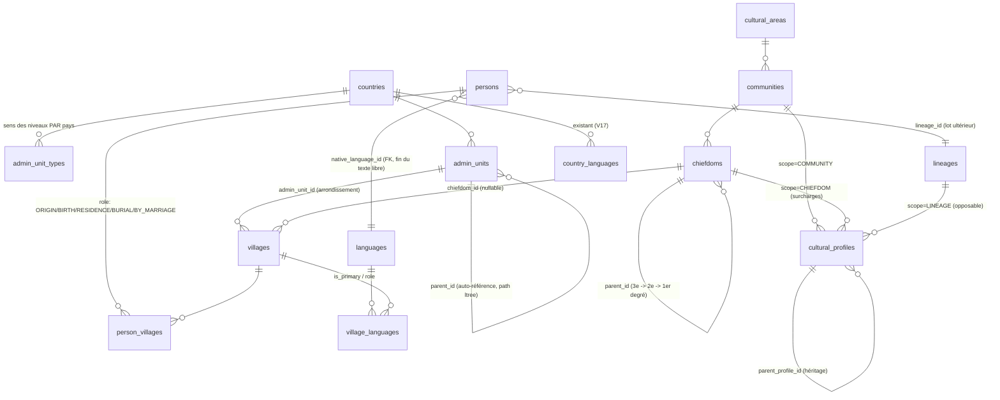

# Étude de faisabilité — Immersion culturelle par villages, traditions et coutumes

**Projet** : GWANG MEU — « chaque village est rattaché à sa tradition, chaque personne vit les coutumes de ses villages »
**Date** : juillet 2026
**Statut** : étude consolidée (4 expertises : inventaire de l'existant, sources de données, anthropologie, architecture fonctionnelle et technique)
**Références croisées** : `docs/regles-metier-bantou-bamileke.md` (RM-01 → RM-87), migrations Flyway V1–V43, code backend `com.gwangmeu.village` / `com.gwangmeu.genealogy`, widgets Flutter `country_village_selector.dart`, `add_person_dialog.dart`.

---

## 1. Résumé exécutif

**Verdict : la vision est FAISABLE dans les contraintes actuelles (Spring Boot + Postgres/Supabase free tier + Flutter web, Cloud Run + Cloudflare Pages, budget ≈ 0), à condition de la livrer par lots additifs sans rupture de la prod, et d'accepter une correction anthropologique majeure : la tradition ne se rattache pas au village seul, mais à une chaîne village → chefferie → communauté → aire, résolue au niveau du lignage de la personne.**

Conditions de faisabilité :

1. **Correction anthropologique** — le rattachement direct `village → profil coutumier` serait une erreur ethnographique (une chefferie bamiléké agrège des dizaines de « villages » ; les Beti-Fang n'ont pas de chefferie ; les Mbororo n'ont pas de village). Le modèle cible est un héritage à surcharges éparses, avec le **lignage d'affiliation** comme niveau opposable (RM-03, RM-07, RM-11) et « droit civil seul » comme défaut absolu.
2. **Données disponibles et gratuites** — le référentiel géographique du Cameroun (10 régions → 58 départements → 360 arrondissements) est importable depuis des sources ouvertes vérifiées (OCHA COD-AB, licence libre) ; les ~13 000–14 000 villages et ~13 536 chefferies existent dans des documents officiels (répertoire BUCREP 2005, PDF MINAT 2015) extractibles en 2–3 jours de travail outillé. La coutume elle-même n'existe dans **aucune** source ouverte : c'est le cœur de valeur propre de GWANG MEU, à collecter par gouvernance communautaire.
3. **Dette technique préalable** — trois bugs bloquants doivent être corrigés en lot 0 : la troncature ISO-3→ISO-2 de `normalizeCountryCode` (« SEN » devient « SE » = Suède), le skip silencieux de la validation villages quand Neo4j est indisponible, et la création de villages ouverte à tout MEMBRE sans déduplication.
4. **Budget 0 tenable** — extensions Postgres nécessaires (ltree, pg_trgm, unaccent, postgis) natives sur Supabase ; CDN Cloudflare gratuit devant les endpoints géo ; chargement des pays à la demande pour rester sous les 500 Mo du free tier (Cameroun seul ≈ 4–5 Mo).
5. **Garde-fous non négociables** — la coutume ne produit jamais de refus dur (RM-07), les données ethniques des vivants sont masquées par défaut (RGPD art. 9, RM-77), aucun profil n'est activé par défaut sans validation par des dépositaires de la coutume.

Recommandation : **scénario B** (référentiel géo hiérarchique générique + profils coutumiers hérités et versionnés + immersion progressive), découpé en 4 lots — lot 0 dette, lot 1 MVP Cameroun « référentiel + cascade », lot 2 coutumes et immersion, lot 3 extension Afrique.

---

## 2. Vision et périmètre

### 2.1 Vision du fondateur (verbatim reformulé)

- Chaque **village** est rattaché à sa **tradition** ; chaque **personne** se voit appliquer les coutumes de son ou ses villages : l'utilisateur vit une **immersion culturelle** totale selon les villages dont il est issu.
- Le référentiel géographique doit être **hiérarchique et lié** : pays → région → chef-lieu/département → village, chaque niveau uniquement **sélectionnable** dans les formulaires (fin du texte libre), avec les **langues** pratiquées attachées.
- Démarrage : **Cameroun** ; extension prévue à **toute l'Afrique**.
- Contraintes : GWANG MEU tourne déjà en production (Spring Boot + Postgres/Supabase + Flutter web, Cloud Run + Cloudflare Pages), petit budget (gratuit autant que possible).

### 2.2 Ce que l'étude valide, ce qu'elle corrige

| Élément de la vision | Verdict de l'étude |
|---|---|
| Référentiel géo hiérarchique sélectionnable | ✅ Validé tel quel — modèle `admin_units` auto-référencé, cascade à profondeur variable par pays |
| « Chef-lieu » comme niveau | 🔧 Ajusté : le chef-lieu est un **attribut** du département/arrondissement (`chef_lieu_name`), pas un niveau supplémentaire — colle au découpage officiel camerounais |
| Langues attachées au territoire | ✅ Validé — `village_languages` M:N, héritage descendant pays → aire → village, clé Glottolog |
| Village → tradition en lien direct | 🔧 **Corrigé** : la tradition vit au niveau chefferie/communauté/lignage ; le village est le point d'entrée qui **suggère**, jamais l'unité qui impose (§5.3, expertise anthropologique) |
| Coutumes « appliquées » à la personne | 🔧 Reformulé : coutumes **proposées puis choisies** — la coutume est déclarée par la lignée, jamais imposée ; jamais de refus dur (RM-07) ; opt-out toujours possible |
| Cameroun puis Afrique | ✅ Validé — à condition d'un modèle à profondeur variable (le Nigeria a 3 niveaux, la RDC 5) et d'un pipeline d'import par pays, pas de tables figées |

### 2.3 Hors périmètre de cette étude

Monétisation, natif mobile, migration d'hébergeur, refonte des règles légales existantes (`country_marriage_rules` / `ComplianceService` restent la couche légale, intouchée).

---

## 3. État des lieux

### 3.1 Ce qui existe et sert de socle

- **Table `villages`** (V3, V6) : ~130 villages seedés (30 multi-pays + 100 localités camerounaises) avec GPS, plus les créations utilisateurs. Table « objet social » vivante : membres, abonnements (`village_subscriptions`), feed.
- **`person_villages`** (V14) : lien N:N personne↔village structuré — mais **sans rôle** (ORIGIN/RESIDENCE/BURIAL…).
- **`countries`** (10 pays seedés), **`languages`** + **`country_languages`** (~86 entrées, dont 15 langues camerounaises aux noms de chefferies : Bandjoun, Bangangté, Dschang, Nso…), **`clans`/`person_clans`** (V18, rattachés au village), **`dialect_areas`** (V36, isolée).
- **Couche légale** : `country_marriage_rules` (18 pays, V40–V42) + `ComplianceService` (COMPLIANT/WARNING/NON_COMPLIANT/UNKNOWN, un seul refus dur : 2ᵉ union civile en pays interdisant la polygamie).
- **Référentiel métier** : `docs/regles-metier-bantou-bamileke.md` — 624 lignes, ~87 règles arbitrées, qui préfigure exactement ce chantier (RM-02 descent_system, RM-03 lignages/ndap, RM-04 chefferies, RM-05 rôles de person_villages, RM-07 profils coutumiers, RM-08 calendrier, RM-77 privacy).
- **Infra front récente** : modules `frontend/lib/core/cache/` et `core/connectivity/` — support tout trouvé pour le cache/offline du futur sélecteur en cascade.

### 3.2 Les huit limites bloquantes (synthèse de l'inventaire)

1. **Doublons de villages possibles** : aucune contrainte UNIQUE (name, country) ; création ouverte à tout MEMBRE sans recherche préalable (`VillageServiceImpl.create:30-47`) — la javadoc du contrôleur annonce « AMBASSADEUR minimum », le code accepte MEMBRE (`VillageController.java:71-92`).
2. **Pas de hiérarchie ni de typage** : pas de parent, pas de degré de chefferie, région en texte libre ; Yaoundé (4,1 M hab.) et un hameau bamiléké cohabitent dans la même table sans distinction.
3. **Double vérité village** : `persons.origin_village` en TEXTE LIBRE (V43) coexiste avec `person_villages` structuré (V14), saisis côte à côte dans le même formulaire, sans réconciliation.
4. **`person_villages` sans rôle** ; validation « villages des ancêtres » seulement à l'update, **skip silencieux si Neo4j est down** (`GenealogyServiceImpl:1415-1418`).
5. **Aucun lien village → coutume** : la seule coutume codée est au niveau PAYS ; `primary_dialect` et `cultural_links` sont décoratifs.
6. **Bug pays** : `normalizeCountryCode:1377-1383` tronque tout code > 2 caractères — « SEN » (Sénégal) devient « SE » (Suède) ; double représentation pays sur villages (VARCHAR-3 + UUID) ; code ISO tapé à la main dans `create_village_screen.dart:227-236`.
7. **Clan/totem/langue en texte libre** sur les personnes malgré les tables structurées existantes (la relation langue choisie dans une liste structurée est perdue au stockage : `add_person_dialog.dart:1619` envoie le nom, pas l'id) ; `users.origin_village_id` sans FK.
8. **Privacy** : clan/totem/langue/village d'origine = données ethniques (RGPD art. 9) affichées sans masquage (RM-77 non implémentée).

---

## 4. Sources de données (vérifiées en ligne, juillet 2026)

### 4.1 Découpage administratif du Cameroun

Hiérarchie officielle confirmée : **10 régions → 58 départements → 360 arrondissements** → villages/quartiers. (La commune — 374 — est une entité décentralisée distincte ; l'arrondissement est le bon niveau 3.)

| Source | Contenu CMR | Volumétrie vérifiée | Rattachement hiérarchique | Licence | Format |
|---|---|---|---|---|---|
| **OCHA COD-AB** (HDX) | ADM0–ADM3, polygones + gazetteer avec P-codes ; source officielle INC | ADM3 = 360 arrondissements ; pas de niveau village | Parfait jusqu'à l'arrondissement (P-code parent) | CC-BY (usage libre avec attribution) | SHP, XLSX |
| **geoBoundaries** | ADM0–ADM3 | ADM1=10, ADM2=60, ADM3=360 | Polygones emboîtés, pas de P-codes | ADM0-2 CC-BY ; **ADM3 CMR : ODbL** (dérivé OSM) | GeoJSON, API |
| **BUCREP — Répertoire des villages** (3ᵉ RGPH 2005) | LA référence village : région → département → arrondissement → canton/groupement → **village/quartier**, population par sexe | ~13 000–14 000 villages (436 pages) | **Le meilleur rattachement village→arrondissement existant**, mais figé 2005, sans GPS | Publication publique, réutilisation tolérée avec citation | **PDF uniquement** → extraction Tabula/Camelot |
| **GeoNames** (dump CM) | Toponymes géolocalisés | 24 061 entrées dont **14 374 lieux habités** ; mais ADM3 = 16/360 seulement | Rattachement s'arrête au département | **CC-BY 4.0** | TSV, API |
| **OpenStreetMap** | Lieux nommés géolocalisés | 10 643 place=village + 1 702 hamlet/town/city | Aucun rattachement admin (à calculer point-dans-polygone) ; couverture inégale | **ODbL** (share-alike) | Overpass, Geofabrik |
| **Wikidata** | Items villages | 4 061 items « village » pays=Cameroun | Hétérogène | **CC0** | SPARQL |
| **UN SALB** | — | Aucun jeu téléchargeable pour le CMR | — | — | À écarter |

**Seul le couple COD-AB (polygones + P-codes) × BUCREP (liste nominative) donne la chaîne complète pays→village.** GeoNames apporte les coordonnées (croisement par similarité de nom restreinte au même département) ; OSM en couche séparée si l'ODbL est acceptée.

### 4.2 Chefferies — le registre officiel existe (PDF MINAT, novembre 2015)

- **~79-80 chefferies de 1ᵉʳ degré, 875 de 2ᵉ degré, 12 582 de 3ᵉ degré ≈ 13 536 chefferies**, organisées région → département → arrondissement → groupement/canton (décret 77-245).
- Point structurant pour GWANG MEU : **la chefferie de 3ᵉ degré ≈ le village, celle de 2ᵉ degré ≈ le groupement** — c'est exactement le chaînon village→tradition demandé par RM-04.
- Les PDF MINAT (1ᵉʳ/2ᵉ degré nationaux, 3ᵉ degré par région) sont téléchargeables et extractibles (~2-3 jours avec contrôle qualité). Aucune donnée ouverte structurée ; le « fichier national actualisé » annoncé en 2018 n'est pas publié.
- Stratégie : **extraction PDF = socle officiel horodaté 2015, puis crowdsourcing communautaire validé** (rôle AMBASSADEUR) pour les évolutions post-2015, le géocodage et les rattachements ambigus.

### 4.3 Langues

| Source | Contenu | Verdict |
|---|---|---|
| **Glottolog 5.3** | **317 langues rattachées au CM** (vérifié dump CLDF), glottocodes stables, familles, 1 point GPS/langue | ✅ **Source pivot** — CC-BY 4.0, dump CSV propre. Adopter le **glottocode comme clé** de la table `languages` |
| **Ethnologue** | 282 langues, cartes polygonales | ❌ À écarter — paywall 480 $/pers/an, aucun droit de redistribution |
| **ALCAM** (atlas IRD 1983/2012) | ~250-260 langues, cartes par zones | 📖 Source d'expertise pour valider, pas pour importer (scans, copyright CERDOTOLA) |
| **CLEAR Global / TWB** (HDX) | **% de locuteurs par langue au niveau DÉPARTEMENT** (recensement 2005, 69 langues) | ✅ La seule table langue↔zone prête à l'emploi — vérifier la licence exacte avant usage commercial |

**Précision réaliste** : la langue PAR VILLAGE n'existe dans aucune source ouverte. Faisable : (a) langues par département (CLEAR Global) ; (b) langue par aire (Glottolog) ; (c) dans les Grassfields, la quasi-bijection **chefferie ↔ langue** (Bandjoun↔Ghomálá', Bafut↔Bafut) permet de pré-remplir langue-par-village dès le rattachement à la chefferie — puis validation communautaire.

### 4.4 Extension Afrique

- **geoBoundaries** : tous les pays africains, ADM2 partout, ADM3–5 selon pays, CC-BY.
- **fieldmaps.io** : jeux « edge-matched » mondiaux ADM0→ADM4 (COD-AB + geoBoundaries en secours), ODbL ; variante « open » 100 % geoBoundaries.
- **OSM Afrique** : ~620 k localités nommées hors villes (306 100 villages + 312 163 hameaux), ODbL.
- **GRID3** : > 9 M d'implantations détectées par satellite (49 pays subsahariens) — majoritairement sans nom, licences variables (CMR en CC BY-NC-SA : attention) ; utile plus tard pour géocoder.
- Registres de chefferies : le PDF MINAT est une spécificité camerounaise ; ailleurs (Ghana, Nigeria) c'est moins structuré → **le modèle « import officiel + crowdsourcing validé » sera la règle, pas l'exception**.

### 4.5 Ce qu'aucune source ouverte ne fournit (= valeur propre de GWANG MEU)

Quartiers urbains et hameaux hors répertoires ; évolutions post-2015 des chefferies ; coordonnées des villages non géocodés ; langues effectives par village hors Grassfields ; et **TOUTES les données coutumières** (descent_system, exogamie, étapes de dot, calendrier, titres — RM-02/03/07/08). À collecter via les ambassadeurs avec workflow de validation (§8).

---

## 5. Modèle cible

### 5.1 Principe directeur : DEUX hiérarchies parallèles, pas une

L'expertise anthropologique est formelle : le village est une unité de **peuplement** ; la coutume vit dans des unités **politiques et lignagères** qui ne coïncident pas avec lui. Quatre preuves camerounaises : la chefferie bamiléké (la'a) agrège des dizaines de « villages » d'état civil (attacher un profil à chaque village de Bandjoun créerait ~60 copies divergentes de la même coutume) ; les Beti-Fang sont historiquement acéphales (l'unité coutumière est le mvog/lignage) ; au Nord, lamidats peuls, massifs kirdi acéphales et Mbororo sans village ; enfin la doctrine des tribunaux coutumiers applique la coutume **des parties**, pas du territoire.

```
A. HIÉRARCHIE GÉO-ADMINISTRATIVE          B. MAILLAGE COUTUMIER (parallèle)
   (formulaires, vision fondateur)            (immersion, RM-02/03/04/07)

   pays                                       aire culturelle (~6 pour le CMR)
    └─ région (10)                             └─ communauté/peuple (Bamiléké, Duala, Ewondo…)
        └─ département (58)                        └─ chefferie / unité coutumière (la'a, lamidat…)
            └─ arrondissement (360)                    └─ lignage (ndap) ← niveau OPPOSABLE
                └─ village  ──────── FK chiefdom_id ──────┘
```

Elles se recouvrent sans coïncider : la chefferie Bandjoun est dans le département Koung-Khi, mais des ressortissants « d'origine Bandjoun » naissent à Douala. Le village porte une FK vers chacune. **Une VILLE ne porte jamais de profil coutumier** (Douala est en terroir sawa mais cosmopolite) : la coutume s'atteint par le village d'ORIGINE, la ville n'est que résidence.

### 5.2 Schéma d'entités



### 5.3 Le socle géographique (`admin_units`)

- Table **auto-référencée** : `id, country_id, parent_id, level, name, name_norm` (généré, sans accents/casse), `path LTREE` (requêtes sous-arbre sans CTE récursive), `centroid GEOGRAPHY` (postgis déjà actif), `source/source_ref` (P-code COD-AB), `status` (ACTIVE/MERGED/DEPRECATED pour les fusions administratives), `UNIQUE (parent_id, name_norm)`.
- **`admin_unit_types`** donne le **sens des niveaux par pays** (CMR : 1=région, 2=département, 3=arrondissement ; Nigeria : state→LGA→ward ; RDC : 5 niveaux) — le front itère sur les niveaux, il ne connaît pas « région/département » en dur. C'est la clé de l'extension Afrique.
- Index : GIN pg_trgm sur `name_norm` (typeahead < 10 ms à 500 k lignes), GIST sur `path`.
- **Verrouillé** : personne ne crée d'`admin_units` via l'app — import versionné ADMIN uniquement, ré-importable quand un décret change le découpage (RM-70).
- Le « chef-lieu » de la vision fondateur = attribut `chef_lieu_name` du département/arrondissement.

### 5.4 Les villages (table existante ENRICHIE, jamais remplacée)

`villages` reste la table « objet social » (membres, feed, abonnements V3) — on ne la fusionne pas dans `admin_units`. Ajouts :

- `admin_unit_id FK` (nullable pendant la transition), `village_type ∈ {VILLAGE, TOWN, CITY, CHIEFDOM_D1, CHIEFDOM_D2, CHIEFDOM_D3}` — résout le mélange Yaoundé/hameau ;
- `chiefdom_id FK chiefdoms` optionnelle (RM-04, lot 2) ;
- `name_norm` généré + **contrainte `UNIQUE (name_norm, admin_unit_id) WHERE status='ACTIVE'`** ; en secours pendant la transition, unicité souple `(name_norm, country_id)` avec avertissement ;
- cycle de vie **`status ∈ {PROPOSED, VERIFIED, MERGED, REJECTED}`** + `merged_into_id` (auto-référence) + `proposed_by/verified_by/verified_at` :
  - **PROPOSED est utilisable immédiatement** (badge « en attente de vérification ») — ne jamais bloquer la saisie généalogique sur la modération ;
  - **MERGED = redirection, jamais suppression** : toutes les FK entrantes (`person_villages`, `village_subscriptions`, `users.origin_village_id`, `clans.village_id`, feed) réécrites en transaction vers le canonique ; `merged_into_id` résout les références retardataires ;
  - **REJECTED** : rattachements convertis en texte de secours, proposant notifié avec motif ;
- assainissement pays : `country_id UUID` devient LA vérité, `country VARCHAR(3)` synchronisé par trigger puis déprécié.

### 5.5 Le maillage coutumier (RM-02/03/04/07)

Cinq entités nouvelles minimales (expertise anthropologique) :

- **`cultural_areas`** (~6 pour le CMR : Grassfields bamiléké-bamoun, Grassfields NW anglophone, Sawa côtier, Beti-Fang-Bassa forêt, Soudano-sahélien, Peuples forestiers Baka/Bakola) — sert aux **défauts** (`ethnic_group_defaults`, RM-02) et au thème visuel, jamais à une règle opposable.
- **`communities`** (Bamiléké, Bamoun, Nso', Duala, Bassa, Ewondo, Bulu, Mafa, Peul/Fulbe, Baka…) — porte le profil générique publié et sourcé (le « Bamiléké (générique) » prescrit par RM-07).
- **`chiefdoms`** (RM-04) : nom, **type d'unité** {CHEFFERIE_1/2/3_DEGRÉ, LAMIDAT, SULTANAT, CANTON, COMMUNAUTÉ_ACÉPHALE}, `parent_id` (héritage 3ᵉ→2ᵉ→1ᵉʳ degré), `community_id`, jour de marché + noms des 8 jours (RM-08). Le degré vient du référentiel officiel (décret 77-245), **jamais** d'une déclaration utilisateur (les rangs sont un contentieux endémique) ; statut « contesté » neutre prévu.
- **`cultural_profiles`** (RM-07) — voir §5.6.
- **`lineages`** (RM-03) : fondateur, chefferie d'origine, ndap masculin/féminin, descent_system + `persons.lineage_id` — « l'entité manquante la plus structurante », réservée au lot ultérieur (`scope='LINEAGE'` lui garde sa place sans migration de schéma).

### 5.6 Les profils coutumiers : héritage, versionnage, contenu

```sql
cultural_profiles (
  code UNIQUE,                        -- 'CIVIL_DEFAULT', 'BAMILEKE_GENERIC', 'BANDJOUN'
  scope ∈ {COUNTRY, ETHNIC_AREA, COMMUNITY, CHIEFDOM, LINEAGE},
  parent_profile_id,                  -- chaîne : BANDJOUN → BAMILEKE_GENERIC → CIVIL_DEFAULT
  descent_system ∈ {PATRILINEAL, MATRILINEAL, BILINEAR, COGNATIC},  -- RM-02, colonne TYPÉE hors JSONB
  rules JSONB,                        -- overrides par FAMILLE de règles
  schema_version, version, status ∈ {DRAFT, PUBLISHED, ARCHIVED},
  valid_from, valid_to,               -- RM-70 : versionnage daté
  sources TEXT                        -- chaque attribut sourcé (doctrine legal_basis de V40)
)
```

- **Attributs épars** : une surcharge ne stocke que ses deltas ; fusion = merge superficiel **par famille de règles** le long de la chaîne parent (l'enfant remplace la famille entière qu'il redéfinit — pas de deep-merge clé à clé, source de bugs indébogables). Validation JSON Schema au passage DRAFT→PUBLISHED.
- **Un profil PUBLISHED est immuable** : modifier = nouvelle version datée ; les évaluations persistées stockent `(profile_code, version)` → auditables et rejouables (RM-70). La coutume est orale et évolutive : les profils sont des **déclarations datées, pas des codifications** (l'erreur des états civils coloniaux).
- **Quatre couches de contenu** (expertise anthropologique, alignées RM-01→87) :
  - **A. Variables structurelles** : `descent_system` (la variable maîtresse, RM-02), mode d'affiliation lignagère (la dot fait-elle le pater ? RM-11), `exogamy_scope` {NONE, CIVIL_ONLY, LINEAGE, CLAN, VILLAGE} + profondeur bilatérale + flag `cousin_marriage_preferred` (Peuls : l'interdit global serait une faute, RM-14), `succession_rule` (RM-45) + désignation secrète (RM-46) + héritier unique (RM-47).
  - **B. Modules activables** : lévirat/sororat (consentement de la veuve universel, non configurable, RM-60) ; étapes et items de dot par chefferie (RM-27/29/30 — le versant LÉGAL de la dot reste au niveau pays, RM-28) ; semaine de 8 jours + jour de marché (niveau chefferie uniquement, RM-08) ; funérailles différées (RM-59) ; garde des crânes (RM-63) et concessions (RM-06), masqués pour les profils non concernés ; sociétés coutumières à visibilité verrouillée (RM-85).
  - **C. Lexiques (l'immersion linguistique)** : terminologie de parenté classificatoire (RM-68), titres (fo, mafo, tagni — RM-53), ndap par lignage (RM-03), noms des 8 jours, systèmes de nomination (RM-64/65/66), salutations et proverbes sourcés.
  - **D. Privacy et sacré** : rayon de confidentialité (RM-78), liste des champs SACRÉS (totem, localisation des crânes, affiliations initiatiques — restreints même post-mortem, RM-79).
- **Garde-fous transverses** : jamais de refus dur coutumier (axe `custom_compliance` parallèle au `compliance_status` légal, RM-07) ; aucune option d'exclusion des femmes, même configurable (arrêt Zamcho, Protocole de Maputo art. 21 — RM-49) ; aucun droit sur une personne adossé à la dot (RM-32) ; aucun statut d'illégitimité d'enfant (RM-21).
- `country_marriage_rules` / `ComplianceService` **ne sont pas touchés** : couche légale et couche coutumière restent deux plans parallèles, deux badges distincts dans l'UI.

### 5.7 Précédence personne → coutume (l'arbitrage central)

La proposition du fondateur (« coutume du village d'origine ») est presque juste ; l'anthropologue la corrige sur un point : **le pivot n'est pas le village, c'est le LIGNAGE D'AFFILIATION** (RM-11), le village d'origine en découle (RM-05). Ordre de précédence, première trouvée gagne :

1. **Choix explicite de la personne / de l'arbre** (ou opt-out) — prime toujours. « Un arbre/lignage CHOISIT son profil » (RM-07). L'opt-out désactive évaluation et immersion mais ne supprime aucun fait.
2. **Profil du lignage d'affiliation** (RM-11) : patrilinéaire → lignage du père si la dot est accomplie, sinon lignage maternel (rachat possible, bascule proposée et historisée) ; matrilinéaire → lignage maternel toujours ; BILINEAR/COGNATIC ou inconnu → **choix explicite demandé, jamais de défaut silencieux**.
3. **Suggestion depuis la chefferie du village d'ORIGINE** (`person_villages` rôle ORIGIN → `villages.chiefdom_id` → profil) — statut « suggéré, non confirmé », **jamais auto-appliqué**.
4. **Défaut absolu : « droit civil seul »** (`CIVIL_DEFAULT`, RM-07).

Nuance d'implémentation (arbitrage entre expertises, cf. annexe) : le moteur (`CustomsEngine`) peut **afficher** du contexte non sensible issu du village (jour de marché, langues, fiche chefferie) sans confirmation, mais toute **évaluation coutumière** (`custom_compliance`, exogamie, succession) n'opère que sur un profil **choisi/confirmé**.

Cas particuliers : plusieurs villages père/mère → **double ancrage** (RM-22), profil ACTIF unique + lignage secondaire affiché et opérationnel (oncle maternel, notifications décès), jamais de « mélange » des deux coutumes ; **diaspora** → la coutume suit l'ORIGINE, la résidence ne pilote que le référentiel légal (RM-69), immersion opt-in hors du pays ; **mariage mixte** → chaque époux garde son profil, les enfants reçoivent une suggestion confirmée par les parents (RM-12) ; **RGPD** → le profil coutumier d'un vivant est une donnée ethnique art. 9, masqué hors cercle familial (RM-77).

### 5.8 Langues

- `languages` + `iso639_3` + **`glottocode`** (UNIQUE nullable — seule clé fiable pour les langues bamiléké fines : Ghomálá' = ghom1247, Medumba = medu1238) ; backfill des ~86 seeds par CSV.
- **`village_languages`** M:N (village, langue, rôle PRIMARY/SECONDARY/VEHICULAR, source), pré-alimentée par héritage descendant (langues du pays → affinage par département via CLEAR Global → bijection chefferie↔langue dans les Grassfields), **ajustable par l'ambassadeur** — l'héritage n'est qu'une valeur initiale. Migration de `villages.primary_dialect` texte par matching (bon signal : les 15 langues camerounaises de V17 portent des noms de chefferies).
- `persons.native_language_id` / `users.native_language_id` FK — l'UI choisit déjà dans une liste structurée, seul le stockage perd la relation : on répare le stockage sans changer l'UX. Texte conservé en lecture legacy puis déprécié.
- **i18n de l'app** (trajectoire, pas MVP) : lot 2 = externalisation ARB fr/en (aujourd'hui locale forcée `fr`, `app.dart:233-237`) ; lot 3 = langues africaines véhiculaires. Les contenus culturels en langue locale (salutations, ndap, proverbes) ne passent PAS par l10n système : ce sont des **contenus** portés par profils et villages, affichés avec traduction française.

### 5.9 Formulaires : le sélecteur en cascade

Composant unique **`CascadeGeoSelector`** (remplace `country_village_selector.dart`, réutilisé par add_person, edit_person, add_union, profile_edit, « Proposer un village » — cinq points de texte libre éliminés) :

- **Niveaux dynamiques** pilotés par `admin_unit_types` du pays (le widget itère, il ne code pas « région/département ») ; 4 niveaux visibles pour le CMR (l'arrondissement est résolu automatiquement derrière le département — 4 champs est la limite haute sur mobile ; le modèle permet 5 si le fondateur l'exige).
- **Typeahead à chaque niveau** (recherche serveur trgm, debounce 300 ms) et surtout **recherche remontante** : taper « Bandjoun » directement au niveau village sans avoir rempli région/département → résultat avec fil d'Ariane « Cameroun › Ouest › Koung-Khi », la sélection remplit la cascade. C'est le parcours n°1 réel : les gens connaissent leur village, pas toujours leur département.
- Multi-sélection conservée (chips) pour les origines multiples ; villages PROPOSED badgés ; MERGED résolus silencieusement.
- **Pré-remplissage** : ajout d'un enfant → villages ORIGIN du parent pertinent (défaut patrilinéaire actuel, puis selon `descent_system` du profil au lot 2 — toujours modifiable, jamais imposé).
- **Mode dégradé « Mon village n'existe pas »** (accessible seulement après une recherche) : nom* + arrondissement pré-rempli + type + anti-doublon « Vouliez-vous dire… » à écarter explicitement → création en PROPOSED, rattachement immédiat, entrée en file de modération. Repli ultime si même l'arrondissement est inconnu : saisie texte dans `origin_village` (le champ V43 garde ce seul rôle) avec bannière « sera rapproché plus tard ».
- **API** : `GeoController` en lecture publique (`/geo/units`, `/geo/units/{id}/villages`, `/geo/search`), payloads minimaux, **`Cache-Control` + ETag + routage `/api/v1/geo/*` derrière Cloudflare** → le CDN absorbe la charge, coût CPU Cloud Run ≈ 0. Front : cache 2 étages (Riverpod + module `core/cache/` persistant TTL 7 j), préchargement du pays de l'utilisateur (bundle CMR gzip ≈ 400-500 Ko) → cascade instantanée et offline de fait.

### 5.10 Rétrocompatibilité : trois gisements à migrer, zéro perte

1. **~130 villages seedés (V7+V30)** : mapping CSV hors ligne → `VERIFIED` + typage (Yaoundé/Douala = CITY ; Bandjoun/Baham/Bana/Bazou = CHIEFDOM_*) ; les 30 non-camerounais restent VERIFIED avec `admin_unit_id NULL` jusqu'à l'import de leur pays.
2. **Villages créés librement en prod** : passage en PROPOSED (flag legacy), file de modération triée par `member_count` décroissant, outillage de fusion. Aucun rattachement cassé pendant la revue.
3. **`persons.origin_village` texte libre (V43)** : rapprochement **assisté**, jamais automatique — batch de matching trgm (score ≥ 0,55, restreint au pays) → table `origin_village_matches` → carte de confirmation à l'utilisateur habilité (« Vouliez-vous dire Bandjoun (Ouest › Koung-Khi) ? ») → accepté = `person_villages(role=ORIGIN)`, le texte brut **conservé comme provenance**. Doublement justifié : homonymes (Bamendjo/Bamendjou/Bamedjo) et RGPD art. 9 (le rattachement ethnique d'un vivant ne se déduit pas en silence, RM-77). Doctrine cible : **`person_villages` structuré = vérité ; `origin_village` texte = libellé de secours**.

`person_villages` gagne `role` (défaut ORIGIN, sémantique actuelle du formulaire) + `verification_status` ; validation ancêtres étendue à `createPerson`/`createChild` ; Neo4j down ⇒ lien créé `UNVERIFIED` + re-validation asynchrone, fin du skip silencieux.

---

## 6. Scénarios comparés

Trois scénarios produit, adossés aux trois solutions techniques instruites (A « niveaux figés », B « admin_units auto-référencée », C « géo-service externalisé »).

### Scénario A — Minimal : « référentiel géo seul, niveaux figés »

Tables séparées `regions`/`departments`/`arrondissements` + `villages.arrondissement_id`, 4 dropdowns câblés en dur, seeds Flyway purs, pas de couche coutumière (ou une extension minimale de `ComplianceService` par village avec précédence en dur).

| | |
|---|---|
| **Coûts** | Stockage et CPU minimes ; complexité très faible (4 entités plates) |
| **Effort** | ≈ S/M — le plus rapide à livrer |
| **Risques** | **Rédhibitoires pour la vision** : les profondeurs administratives varient (Cameroun 4 niveaux, Nigeria 3, RDC 5) → chaque pays au schéma différent = nouvelles tables + entités + endpoints + front. Le degré de chefferie (RM-04) ne rentre pas dans le moule. Aucune immersion. Dette structurelle garantie sous 6 mois, coût de sortie élevé |
| **Verdict** | ❌ **À écarter** — répond au « fini le texte libre » mais trahit « extension à toute l'Afrique » et ignore « chaque village rattaché à sa tradition » |

### Scénario B — Recommandé : « géo hiérarchique générique + profils coutumiers hérités + immersion progressive » ★

Modèle du §5 en entier : `admin_units` auto-référencée (ltree + pg_trgm), `villages` enrichie avec cycle de vie, maillage coutumier (aires → communautés → chefferies → profils versionnés → lignages réservés), `CustomsEngine` à côté de `ComplianceService`, langues sur glottocodes, cascade Flutter dynamique, immersion par étapes (fiches villages enrichies → Griot contextualisé → terminologie de parenté).

| | |
|---|---|
| **Coûts** | Stockage +5 Mo (CMR) à +200 Mo (Afrique, chargée pays par pays) ; CPU ≈ 0 grâce au CDN ; complexité moyenne (1 table auto-référencée + 1 moteur de merge JSONB, le reste est du CRUD) |
| **Effort** | Lots indépendants ship-ables : socle géo + fix bugs = M ; import CMR = M ; cascade front = M ; rapprochement texte = S/M ; CustomsEngine v1 = M ; langues = S |
| **Risques** | Qualité des sources géo africaines (mitigé : staging + statut + revue) ; homonymes (mitigé : unicité par parent + fil d'Ariane) ; dérive du JSONB rules (mitigé : JSON Schema + merge par famille) ; double vérité texte/structuré pendant la transition (assumée, bornée par la file de rapprochement) |
| **Verdict** | ✅ **Recommandé** — seul scénario compatible avec la profondeur variable par pays, le typage des chefferies, l'héritage coutumier et le budget 0 ; zéro rupture prod (migrations V44+ toutes additives, dépréciations douces) |

### Scénario C — Maximal : « plateforme culturelle complète day 1 »

Géo-service externalisé (schéma Supabase exposé en PostgREST/RLS directement au front, Edge Functions pour la recherche), import GeoNames Afrique complet day 1 (~500 k lignes), profils coutumiers complets avec lignages, i18n multi-langues, thèmes par aire.

| | |
|---|---|
| **Coûts** | Stockage 200-300 Mo immédiats (consomme le free tier pour des pays sans utilisateurs) ; complexité opérationnelle élevée |
| **Effort** | ≈ L (geo M + sécurité RLS M + front M + coutumes M) |
| **Risques** | **Deux plans de sécurité** à maintenir (RLS + Spring Security, alors que les politiques RLS viennent d'être stabilisées) ; couplage du front à Supabase qui contourne l'API contractuelle ; GeoNames est faible précisément là où la vision vit (villages et chefferies camerounaises : trous, doublons, graphies coloniales) → le pipeline staging+revue de B serait de toute façon nécessaire. Pour une équipe d'une personne : deux backends |
| **Verdict** | ⏳ **À garder en évolution possible de B** — pertinent le jour où la lecture géo saturerait Cloud Run ; B n'interdit rien (le schéma `admin_units` restera exposable en RLS sans changement de modèle) |

---

## 7. Feuille de route par lots (scénario B)

Ordre : lot 0 → lot 1 → lot 2 → lot 3. Chaque lot est ship-able seul ; migrations V44→V50 toutes additives.

### Lot 0 — Dette bloquante (préalable technique, invisible utilisateur) — effort S

- Fix `normalizeCountryCode` (`GenealogyServiceImpl.java:1377-1383`) : plus de troncature ; accepter ISO-2 ET ISO-3, résoudre via `countries` (V41 a posé iso3), rejeter en 400 si inconnu. Test unitaire « SEN → SN, pas SE ».
- `country_id` = vérité unique sur villages (trigger de synchro du VARCHAR legacy) ; FK manquante sur `users.origin_village_id` (nettoyage des orphelins puis `ON DELETE SET NULL`).
- `person_villages` : + `role` (défaut ORIGIN) + `verification_status` ; validation ancêtres appelée aussi à la création ; Neo4j down ⇒ `UNVERIFIED` + job de re-validation, fin du skip silencieux (`:1415-1418`).
- Contrainte d'unicité souple sur villages ; `POST /villages` aligné sur sa javadoc (fin de la création MEMBRE définitive — remplacée au lot 1 par la proposition modérée).
- Au passage : corriger le paramètre `existingActiveUnions` reçu-mais-ignoré de `ComplianceService`.

**Acceptation** : « SEN » saisi → « SEN »/« SN » stocké correctement ; aucun doublon strict créable via l'API ; migrations réversibles ; zéro régression sur les fiches existantes.

### Lot 1 — MVP Cameroun « référentiel + cascade » — effort M×3 (géo, import, front)

Contenu : V44 `admin_units`/`admin_unit_types` + import CMR niveaux 1-3 en Flyway (≈ 430 lignes) ; pipeline de masse hors Flyway (`POST /admin/geo/import` → staging `geo_import_rows` → promotion idempotente) pour les ~13-14 k villages BUCREP croisés GeoNames ; rattachement + typage des ~103 villages CMR seedés (CSV de mapping) ; `GeoController` + CDN ; `CascadeGeoSelector` déployé dans les 5 formulaires ; cycle de vie PROPOSED/VERIFIED/MERGED/REJECTED + écran de modération + fusion outillée ; mode dégradé « mon village n'existe pas » ; batch + cartes de rapprochement `origin_village` texte ; `village_languages` + `native_language_id` (V47).

**Doctrine d'import** : Flyway pour la structure et les petits référentiels, job admin pour la masse — les erreurs de données ne polluent jamais l'historique Flyway ; CSV sources dans un repo data séparé.

**Acceptation** :
1. Dans add_person, taper « Bandjoun » au niveau village sans région choisie → résultat « Cameroun › Ouest › Koung-Khi », la sélection remplit la cascade.
2. Créer deux fois « Batoufam » dans le même département → 2ᵉ tentative bloquée avec suggestion de la 1ʳᵉ.
3. Un MEMBRE propose un village inexistant → rattachement immédiat de sa personne + apparition en file de modération ; après fusion par un ambassadeur, la fiche personne pointe le canonique sans action utilisateur.
4. 100 % des personnes avec `origin_village` texte reçoivent un lien confirmé, une carte de suggestion, ou un statut UNMATCHED tracé — aucun texte perdu.
5. Aucun champ pays/région/village en texte libre ne subsiste dans les formulaires (hors repli du mode dégradé).
6. Neo4j coupé pendant une création → personne créée, lien village UNVERIFIED visible, re-validé au retour.

### Lot 2 — Coutumes et immersion (le cœur de la vision) — effort M+M

Contenu : `cultural_areas`/`communities`/`chiefdoms` (extraction PDF MINAT, 3 degrés, `villages.chiefdom_id`) ; `cultural_profiles` (V48) avec **2 profils livrés : `CIVIL_DEFAULT` et `BAMILEKE_GENERIC`** + premières surcharges par chefferie — exactement le livrable minimal de RM-07 ; `CustomsEngine` (résolution §5.7, cache Caffeine 2 niveaux, invalidation par event via le bus V25 existant) ; axe `custom_compliance` non bloquant sur les unions (2ᵉ badge front) ; **PrivacyFilter RM-77** (masquage des données ethniques des vivants) ; clan/totem basculés sur le modèle structuré (V18, RM-12) ; fiches villages enrichies (chemin administratif, chefferie et degré, jour de marché et semaine de 8 jours, langues, clans, ndap notables) ; **Griot contextualisé** (profil coutumier + villages d'origine injectés, citation de la source : « selon la coutume déclarée de votre lignée, chefferie X ») ; ARB fr/en.

Immersion par ordre de légitimité (expertise anthropologique) : ① termes de parenté dans la langue du terroir (RM-68 — la fonctionnalité la plus juste : corrige une vraie erreur de traduction, n'invente rien) ; ② ndap en salutation (nom-éloge public par nature, RM-03) ; ③ calendrier coutumier et jour de marché (RM-08, opt-in) ; ④ titres réels persistés, jamais inférés (RM-53) ; ⑤ parcours de vie migratoire (RM-01) ; ⑥ proverbes sourcés ; ⑦ thème visuel par AIRE seulement — jamais d'iconographie royale ou rituelle (ndop, double-gong, masques kuosi sont des insignes de chefferie, pas du décor d'UI).

**Acceptation** : un arbre rattaché au profil Bamiléké voit warnings d'exogamie et pré-remplissage patrilinéaire ; repassé en « droit civil seul », il ne voit plus rien de coutumier ; aucun refus dur d'origine coutumière possible ; clan/totem/langue/village d'un vivant invisibles pour un non-proche ; jour de marché affiché pour ≥ 20 chefferies pilotes.

### Lot 3 — Extension Afrique — effort M par pays décroissant

Contenu : pipeline d'import géo par pays (format pivot + source documentée + versionné RM-70 ; `admin_unit_types` absorbe les profondeurs variables) ; ordre proposé selon la diaspora déjà présente : **SEN, CIV, COD, puis NGA/GHA** ; profils coutumiers par grande aire (Wolof, Akan, Kongo…) construits avec des référents communautaires ; i18n langues additionnelles ; `lineages`/ndap + `persons.lineage_id` (RM-03) ; terminologie de parenté par communauté (RM-68) ; tableaux de bord qualité (% villages VERIFIED, % personnes rapprochées) ; thèmes culturels.

**Acceptation** : ajouter un pays = exécuter le pipeline sans migration SQL manuelle ; un utilisateur sénégalais vit la même cascade et le même mode dégradé que le camerounais ; métriques qualité par pays consultables par les admins.

---

## 8. Risques et gouvernance

### 8.1 Gouvernance des données coutumières : « déclarée et sourcée, jamais codifiée »

Trois étages de légitimité, calqués sur la subsidiarité RM-48 (famille → chefferie → plateforme en ultime recours) :

1. **Profils COMMUNAUTÉ (génériques)** — rédaction éditoriale depuis l'ethnographie publiée (Hurault, Tardits, Pradelles de Latour, Feldman-Savelsberg…), chaque attribut sourcé (discipline `legal_basis` de V40), bandeau « profil générique, non officiel ». Personne ne « vote » : c'est de la bibliographie.
2. **Surcharges CHEFFERIE** — proposées par un **référent coutumier enregistré** (extension du rôle AMBASSADOR, rattaché à la chefferie), validées par un **collège de N membres qualifiés** (notables/porteurs de titre RM-53, quorum configurable, défaut 2-3, pattern accept/reject V33 réutilisé). Statuts : `COMMUNITY_DECLARED` < `VERIFIED_BY_CHIEFDOM` (canal réaliste : plusieurs grandes chefferies bamiléké ont des structures officielles et des associations de ressortissants organisées).
3. **Profils LIGNAGE** — le seul étage réellement **opposable** : le conseil de famille choisit/surcharge son profil (RM-07, RM-48).

Mécanique commune : toute modification = **proposition avec revue** (jamais d'édition directe d'un profil partagé) ; journalisation qui/quand (RM-84) ; versionnage daté ; statut `DISPUTED` routé conseil de famille → référent chefferie → modération plateforme en ultime recours (un admin anonyme n'a aucune qualité coutumière, RM-55) ; tout profil reste `is_advisory` ; **aucun profil activé par défaut sans validation par des dépositaires de la coutume de la communauté cible** (clause finale du référentiel RM).

### 8.2 Registre des risques

| # | Risque | Gravité | Mitigation |
|---|---|---|---|
| R1 | **Essentialisation / profilage ethnique** : déduire une « identité ethnique » du village et l'afficher (RGPD art. 9) | Critique | L'immersion se déclenche par le profil **choisi**, jamais par inférence ; PrivacyFilter RM-77 ; rapprochement texte→village toujours confirmé par l'utilisateur, jamais silencieux |
| R2 | **Folklorisation du sacré** : totem, crânes, sociétés initiatiques en « éléments d'ambiance » | Critique | Champs SACRÉS restreints même post-mortem (RM-79, RM-63, RM-85) ; revue produit systématique ; jamais d'iconographie rituelle dans l'UI |
| R3 | **Conflits inter-chefferies** (rangs, frontières, successions judiciarisés ; fon du NW en exil) | Élevée | L'app n'arbitre jamais : degré = décret officiel uniquement, statut « contesté » neutre, pas de déclaration utilisateur des rangs |
| R4 | **Figement de la coutume** (l'erreur des états civils coloniaux) | Élevée | Profils = déclarations datées et versionnées (valid_from/valid_to, RM-70), jamais des codifications |
| R5 | **Groupes sans village** (Mbororo pasteurs, Baka semi-nomades) | Élevée | `chiefdom_id` nullable + profil communauté directe ; aucune fonctionnalité n'exige un village (mode « invité » 100 % fonctionnel, CTA doux non bloquant) |
| R6 | **Qualité des sources géo** (BUCREP figé 2005, GeoNames inégal, graphies multiples) | Moyenne | Staging + statuts VERIFIED/UNVERIFIED/COMMUNITY + revue admin + fusion outillée ; crowdsourcing validé pour les trous |
| R7 | **Licences** : ODbL (OSM, fieldmaps ADM3) = share-alike sur la base dérivée ; GRID3 CMR en CC BY-NC-SA | Moyenne | Cœur du référentiel en CC-BY (COD-AB, geoBoundaries gbOpen, GeoNames, Glottolog) ; couches ODbL séparées et optionnelles (décision fondateur D5) |
| R8 | **Free tier Supabase (500 Mo)** saturé par l'import massif | Moyenne | Chargement pays-à-la-demande (CMR ≈ 4-5 Mo ; Afrique entière seulement si des utilisateurs y sont) ; CDN devant les lectures |
| R9 | **Dérive du JSONB `rules`** | Moyenne | JSON Schema validé DRAFT→PUBLISHED, `schema_version`, merge par famille uniquement |
| R10 | **Gamification du sensible** (badge/score sur dot, rang d'épouse, conformité) | Élevée | Interdit produit (RM-81) ; `custom_compliance` informatif, jamais public |
| R11 | **Double vérité texte/structuré** prolongée | Faible | Assumée et bornée : file de rapprochement avec métriques (% UNMATCHED), le texte ne se saisit plus que par le repli ultime |

---

## 9. Décisions attendues du fondateur

| # | Décision | Options | Recommandation de l'étude |
|---|---|---|---|
| **D1** | **La tradition se rattache-t-elle au village ou à la chaîne chefferie→communauté→lignage ?** C'est l'ajustement principal de la vision : le village SUGGÈRE, la lignée CHOISIT | (a) FK directe village→profil ; (b) chaîne d'héritage avec lignage opposable | **(b)** — unanimité des expertises ; (a) est explicitement proscrite par le référentiel métier (RM-07) et créerait ~60 copies de la coutume de Bandjoun |
| **D2** | **Niveaux visibles dans la cascade** : 4 (arrondissement résolu automatiquement derrière le département) ou 5 clics complets ? | 4 / 5 | **4** — limite UX mobile ; le modèle permet 5 sans changement si exigé |
| **D3** | **Création de villages par les membres** : proposition immédiate utilisable (modérée a posteriori) ou verrouillage AMBASSADEUR minimum ? | PROPOSED ouvert / verrouillé | **PROPOSED ouvert à tout MEMBRE** (avec anti-doublon obligatoire et file de modération) — ne jamais freiner la saisie généalogique ; le verrouillage strict ne s'applique qu'à la validation/fusion |
| **D4** | **`origin_village` texte** : conservé en repli ultime ou supprimé ? | Conserver / supprimer | **Conserver** (RM-04) — indispensable tant que les ~12 582 chefferies de 3ᵉ degré ne seront pas toutes en base |
| **D5** | **Licence ODbL acceptable ?** (couche OSM/fieldmaps = share-alike sur la base dérivée) | Oui, en couche séparée / non, CC-BY seulement | **Oui en couche séparée et optionnelle** ; le cœur reste CC-BY |
| **D6** | **Go/no-go extraction des PDF officiels** : BUCREP 2005 (~13-14 k villages) + MINAT chefferies (~13,5 k) ≈ 2-3 jours outillés + contrôle qualité | Go / différer | **Go au lot 1 (BUCREP) et lot 2 (MINAT)** — c'est ce qui rend la vision réelle plutôt que déclarative |
| **D7** | **Ordre d'extension Afrique** | SEN, CIV, COD puis NGA/GHA (diaspora seedée) / autre priorité | **SEN, CIV, COD** — à confirmer selon la traction utilisateurs réelle |
| **D8** | **Quorum du collège de validation chefferie** et identification des premiers référents coutumiers (chefferies pilotes du lot 2, cible ≥ 20) | Quorum 2-3 par défaut, configurable | **2-3** + partenariats avec les associations de ressortissants des grandes chefferies bamiléké |

---

## Annexe A — Contradictions entre expertises et arbitrages du rapporteur

| Sujet | Positions | Arbitrage |
|---|---|---|
| **Chefferies : table dédiée ou valeurs de `village_type` ?** | L'architecte technique proposait CHIEFDOM_1/2/3 comme simples valeurs du type de village ; l'anthropologue et l'architecte fonctionnel une entité `chiefdoms` avec parent, communauté, jour de marché | **Les deux** : `village_type` type le peuplement (lot 1) ; la table `chiefdoms` porte la hiérarchie 3ᵉ→2ᵉ→1ᵉʳ degré et les attributs coutumiers (lot 2) — un enum ne peut pas porter un parent ni un jour de marché |
| **Scope VILLAGE des profils coutumiers** | L'architecte technique incluait `scope=VILLAGE` + table `village_cultural_profiles` ; l'anthropologue exclut le village comme porteur de coutume | **Pas de profil scope VILLAGE** : le village n'est qu'un point d'entrée de suggestion via sa chefferie ; la table de liaison village→profil est remplacée par `villages.chiefdom_id` → profil de chefferie. Évite les ~60 copies divergentes par chefferie |
| **Résolution automatique par le village d'origine** | L'architecte technique résolvait le profil via le village en étape ② ; l'anthropologue exige « suggéré, jamais auto-appliqué » | **Distinction affichage/évaluation** (§5.7) : contexte non sensible affichable depuis le village ; toute évaluation coutumière exige un profil choisi/confirmé |
| **Qui crée un village ?** | Architecte fonctionnel : tout MEMBRE propose (PROPOSED utilisable) ; architecte technique : verrouiller à AMBASSADEUR | **Proposition MEMBRE ouverte** avec anti-doublon et modération (décision D3 soumise au fondateur) — la donnée familiale prime sur la modération |
| **Import massif : Flyway ou pipeline ?** | Solution A tout-Flyway ; solution B structure en Flyway + masse en staging | **Solution B** : Flyway pour ~430 unités administratives, staging idempotent pour les milliers de villages |

## Annexe B — Fichiers pivots du chantier

- Migrations à créer : `backend/src/main/resources/db/migration/V44+` (socle géo, villages enrichis, corrections, langues, profils, staging import).
- Backend : `com/gwangmeu/genealogy/application/GenealogyServiceImpl.java` (normalizeCountryCode :1377-1383, validateAncestorVillages :1409-1438, savePersonVillages :1397-1403), `ComplianceService.java` (intouché sauf param ignoré), `com/gwangmeu/village/` (controller/service — cycle de vie, anti-doublon), nouveau `GeoController`, nouveau `CustomsEngine`.
- Frontend : `frontend/lib/shared/widgets/country_village_selector.dart` (→ remplacé par `CascadeGeoSelector`), `frontend/lib/features/villages/create_village_screen.dart` (→ « Proposer un village »), `frontend/lib/features/genealogy/widgets/dialogs/add_person_dialog.dart` (:847-997, :1130-1170, :1619), `edit_person_dialog.dart`, `add_union_dialog.dart`, `profile_edit_sheet.dart`, modules `frontend/lib/core/cache/` et `core/connectivity/` (cache/offline du sélecteur), `frontend/lib/app.dart` (:233-237, i18n lot 2).
- Référentiel métier : `docs/regles-metier-bantou-bamileke.md` (RM-01→87 — le présent document en est l'étude d'implémentation pour le volet géo-culturel).

## Annexe C — Sources vérifiées (juillet 2026)

https://data.humdata.org/dataset/cod-ab-cmr · https://www.geoboundaries.org/api/current/gbOpen/CMR/ALL/ · https://fieldmaps.io/data · https://download.geonames.org/export/dump/CM.zip · https://ireda.ceped.org/inventaire/ressources/cmr-2005-rec_v4.7_repertoire_actualise_villages_cameroun.pdf · https://ins-cameroun.cm/statistique/repertoire-actualise-des-villages-du-cameroun-troisieme-recensement-general-de-la-population-et-de-lhabitat-du-cameroun/ · https://minat.gov.cm/wp-content/uploads/2020/07/Chefferies-du-1er-degre-Cameroun-les-10-Regions.pdf · https://minat.gov.cm/wp-content/uploads/2020/07/Chefferies-traditionnelles-du-2eme-Degre-du-Cameroun.pdf · https://minat.gov.cm/wp-content/uploads/2020/07/Chefferies-traditionnelles-du-3eme-Degre-Ouest.pdf · https://affocom.com/nomenclature-nationale-des-chefferies-traditionnelles-du-cameroun/ · https://glottolog.org/glottolog?country=CM · https://github.com/glottolog/glottolog-cldf · https://www.ethnologue.com/country/CM/ · https://translatorswithoutborders.org/language-data-for-cameroon/ · https://data.humdata.org/dataset/cameroon-languages · https://horizon.documentation.ird.fr/exl-doc/pleins_textes/2023-11/20388.pdf · https://grid3.org/news/grid3-updates-settlement-extents-for-all-of-sub-saharan-africa · https://salb.un.org/en/data/cmr · https://census-cameroon.com/fr/presentation.php · https://en.wikipedia.org/wiki/Departments_of_Cameroon · https://taginfo.geofabrik.de/africa/tags/place=village
